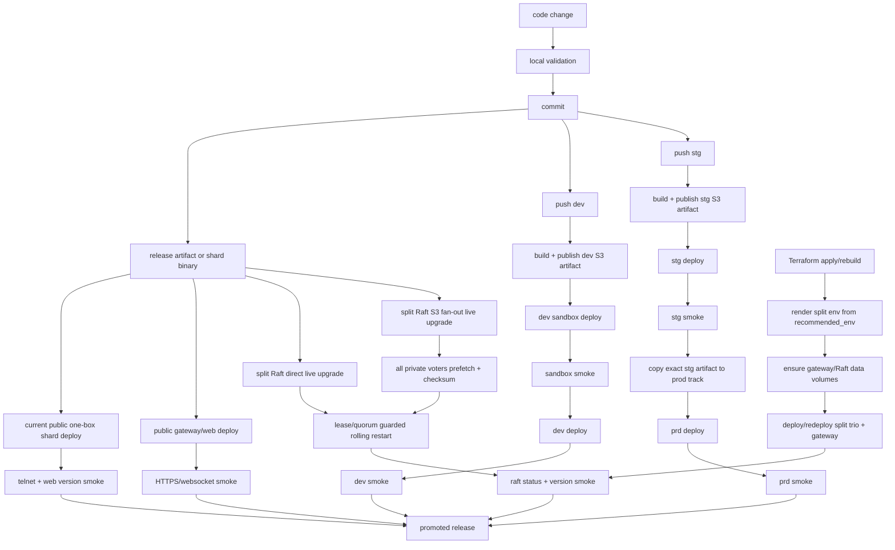

# Deployment Stories

This is the operating map for getting code live, proving it got live, and
surviving instance churn in the single-AZ gateway plus private Raft trio
topology. The machine-readable version lives in
`scripts/deployment_story_dag.py`; the local regression harness checks this doc
against the deploy scripts.

## Deployment DAG

Today `slopmud.com` / `mud.slopmud.com` can still point at the one-box public
host while the split Raft gateway/trio is deployed separately. Keep both stories
tested until public DNS cutover is complete.

## Quorum Contract

A split Raft process restart is allowed only after the deploy controller has:

1. located a visible leader;
2. transferred leadership away from the node being restarted when needed;
3. acquired a cluster-owned Raft restart lease, or explicitly failed when
   `SLOPMUD_RAFT_RESTART_LEASE=required`;
4. verified the two remaining voters are reachable;
5. restarted exactly one voter;
6. waited for cluster readiness and released the lease before continuing.

S3 fan-out may run in parallel before activation because it only stages bytes.
Process activation remains rolling and quorum guarded.

## Local Operator Deploy

Use this when a developer has a known-good local tree and wants a shard-only
change live quickly without touching the public gateway, web service, or
websocket process.

Path:

1. Build or reuse `target/release/shard_01`.
2. Run `just live-upgrade-split-raft-trio-fast /tmp/slopmud-prd-split-az1.env`
   when the binary is already built, or `just live-upgrade-split-raft-trio ...`
   when it should build first.
3. The script stages a versioned shard binary on each private Raft node,
   atomically swaps `SHARD_REMOTE_BIN`, acquires a Raft restart lease, checks
   that the two remaining voters are reachable and that the target is not the
   current leader, restarts one node, waits for the cluster/gateway to recover,
   releases the lease, and repeats.
4. Smoke through the player path with `version`, `raft status`, and a websocket
   reconnect/resume check.

Local regression:

- `just e2e-deployment-stories`
- Scenario: `rapid split Raft live upgrade`
- Assertions: no AWS dependency, active gateway node is delayed, leader is
  transferred before restart, every restart is bracketed by restart lease
  acquire/release, and the quorum guard runs before each restart.

## Current Public One-Box Shard Deploy

Use this while public DNS still points at the one-box host. It updates only the
local shard process behind the public broker/websocket gateway.

Path:

1. Build or reuse `target/release/shard_01`.
2. Run `scripts/deploy_shard_01.sh` with the public env. When the binary is
   already built, set `SLOPMUD_SKIP_BUILD=1` and `SLOPMUD_BIN_SRC`.
3. The script uploads to a versioned release path, atomically swaps
   `SHARD_REMOTE_BIN`, restarts the shard unit, and checks that the shard port
   is listening.
4. Smoke through the configured telnet/websocket endpoint with `version`.

Local regression:

- `just e2e-deployment-stories`
- Scenario: `current public one-box shard deploy`
- Assertions: build reuse is supported, the binary goes through a versioned
  path and atomic symlink swap, the shard service restarts, and the listen check
  remains in place.

## CI/CD Promotion

Dev path:

1. Push to `dev`.
2. CI builds one artifact.
3. CI publishes the artifact to the dev track when S3 is available.
4. CI deploys the same artifact to sandbox and smokes sandbox.
5. CI deploys the same artifact to dev and smokes dev.

Staging to production path:

1. Push to `stg`.
2. CI builds one artifact and publishes it under the stg track.
3. CI deploys the stg artifact and smokes staging.
4. CI copies that exact artifact to the prod track.
5. CI deploys prod from the copied artifact and smokes prod.

No prod rebuild occurs during promotion.

Local regression:

- `just e2e-deployment-stories`
- Scenarios: `CI/CD S3 redeploy wrapper`,
  `CI/CD dev sandbox to dev promotion DAG`, and
  `CI/CD stg to prod promotion DAG`
- Assertions: `prd` maps to the `prod` S3 track, remote shuttle deploy is
  invoked with the resolved artifact URI, public listen checks use
  `SLOPMUD_BIND`, and prod promotion depends on the same stg artifact.

## Split Raft S3 Fan-Out

Use this when the shard binary should be uploaded once and pulled by all Raft
voters before rolling activation.

Path:

1. `just live-upgrade-split-raft-trio-s3 ...` uploads `shard_01` and a sibling
   `.sha256` to S3.
2. All three private Raft nodes pull and verify the artifact concurrently using
   a bounded per-node timeout.
3. Only after prefetch completes does the rolling restart/lease/quorum sequence
   begin.

Local regression:

- `just e2e-deployment-stories`
- Scenario: `split Raft S3 fanout upgrade`
- Assertions: S3 uploads include both binary and checksum, every Raft node
  pulls before any restart, each private-node S3 pull has a bounded timeout, and
  the binary is not redundantly copied by `scp`.

## Instance Replacement

Use this when Terraform replaces the gateway or one or more Spot Raft nodes and
private IPs may have changed.

Path:

1. Apply Terraform for `infra/terraform/single-az-raft-us-east-1`.
2. Render a fresh split env:
   `just render-single-az-raft-env /tmp/slopmud-prd-split-az1.env /home/rob/slopmud/env/prd.env`
3. Mount or remount the persistent data volumes:
   `just ensure-data-volumes /tmp/slopmud-prd-split-az1.env all`
4. Redeploy shard trio units using regenerated private IPs and Raft peer
   addresses.
5. Redeploy gateway broker/web if `HOST`, `GATEWAY_HOST`, or `SHARD_ADDRS`
   changed.
6. Smoke `version`, `raft status`, telnet, and websocket resume.

Local regression:

- `just e2e-deployment-stories`
- Scenario: `node replacement env render and mount targets`
- Assertions: Terraform `recommended_env` fully replaces `SHARD_ADDRS` and
  `SHARD_NODE_HOSTS`, the rendered env is private mode `0600`, data-volume mount
  checks hit the gateway directly, and Raft node checks go through the
  regenerated gateway `ProxyJump`.
